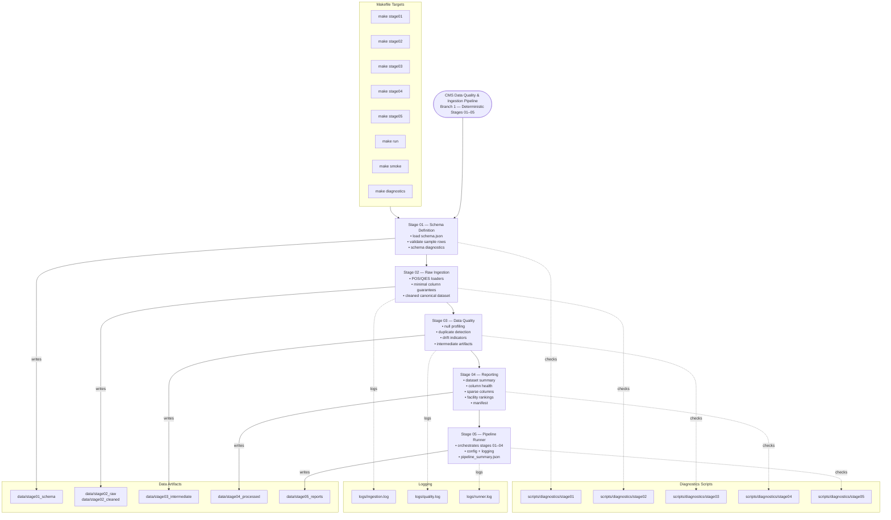

# Pipeline Architecture

```mermaid
flowchart TD
    %% Top-level title
    A0(["CMS Data Quality & Ingestion Pipeline<br/>Branch 1 — Deterministic Stages 01–05"])

    %% Stage boxes
    A1[Stage 01 — Schema Definition<br/>• load schema.json<br/>• validate sample rows<br/>• schema diagnostics]
    A2[Stage 02 — Raw Ingestion<br/>• POS/QIES loaders<br/>• minimal column guarantees<br/>• cleaned canonical dataset]
    A3[Stage 03 — Data Quality<br/>• null profiling<br/>• duplicate detection<br/>• drift indicators<br/>• intermediate artifacts]
    A4[Stage 04 — Reporting<br/>• dataset summary<br/>• column health<br/>• sparse columns<br/>• facility rankings<br/>• manifest]
    A5[Stage 05 — Pipeline Runner<br/>• orchestrates stages 01–04<br/>• config + logging<br/>• pipeline_summary.json]

    %% Pipeline flow
    A0 --> A1 --> A2 --> A3 --> A4 --> A5

    %% Data artifacts (left side)
    subgraph DATA[Data Artifacts]
        D1[data/stage01_schema]
        D2[data/stage02_raw<br/>data/stage02_cleaned]
        D3[data/stage03_intermediate]
        D4[data/stage04_processed]
        D5[data/stage05_reports]
    end

    %% Connect artifacts to stages
    A1 -- writes --> D1
    A2 -- writes --> D2
    A3 -- writes --> D3
    A4 -- writes --> D4
    A5 -- writes --> D5

    %% Diagnostics (right side)
    subgraph DIAG[Diagnostics Scripts]
        X1[scripts/diagnostics/stage01]
        X2[scripts/diagnostics/stage02]
        X3[scripts/diagnostics/stage03]
        X4[scripts/diagnostics/stage04]
        X5[scripts/diagnostics/stage05]
    end

    %% Connect diagnostics
    A1 -. checks .-> X1
    A2 -. checks .-> X2
    A3 -. checks .-> X3
    A4 -. checks .-> X4
    A5 -. checks .-> X5

    %% Logging layer (bottom)
    subgraph LOGS[Logging]
        L1[logs/ingestion.log]
        L2[logs/quality.log]
        L3[logs/runner.log]
    end

    A2 -. logs .-> L1
    A3 -. logs .-> L2
    A5 -. logs .-> L3

    %% Makefile orchestration (top)
    subgraph MK[Makefile Targets]
        M1[make stage01]
        M2[make stage02]
        M3[make stage03]
        M4[make stage04]
        M5[make stage05]
        M6[make run]
        M7[make smoke]
        M8[make diagnostics]
    end

    MK --> A1
```
