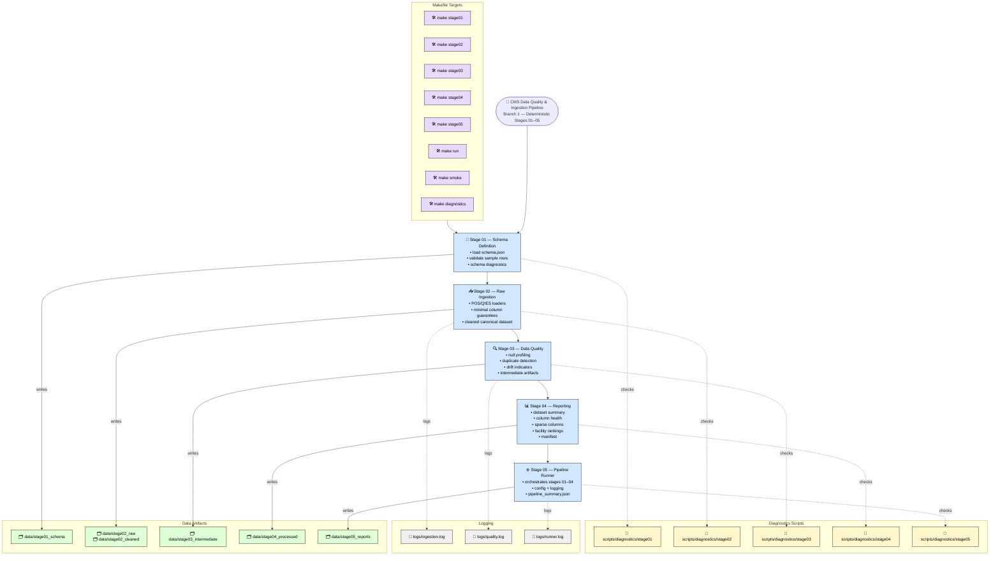

# Pipeline Architecture

---

## Responsibilities & Outputs (CMS Branch 1)

### 📘 Stage 01 — Schema Definition

**Responsibilities**

- Load and validate `schema.json`
- Check column types and required fields
- Validate sample rows
- Run schema diagnostics

**Outputs**

- `data/stage01_schema/schema.json`
- Stage 01 schema diagnostics report

---

### 📥 Stage 02 — Raw Ingestion (POS/QIES)

**Responsibilities**

- Fetch POS/QIES raw files
- Ingest parquet/CSV into canonical format
- Apply minimal column guarantees
- Clean POS data into unified dataset
- Run ingestion diagnostics

**Outputs**

- `data/stage02_raw/*.parquet`
- `data/stage02_raw/*.csv`
- `data/stage02_cleaned/cleaned_data.csv`
- POS/QIES ingestion diagnostics

---

### 🔍 Stage 03 — Data Quality Profiling

**Responsibilities**

- Null profiling
- Duplicate detection
- Drift indicators
- Generate intermediate artifacts
- Run quality diagnostics

**Outputs**

- `data/stage03_intermediate/*`
- Quality profiling diagnostics
- Drift / null / duplicate summaries

---

### 📊 Stage 04 — Reporting

**Responsibilities**

- Generate dataset summary
- Score column health
- Detect sparse columns
- Produce facility ranking reports
- Build dataset manifest

**Outputs**

- `data/stage04_processed/*`
- Facility ranking reports
- Column health reports
- Dataset manifest

---

### ⚙️ Stage 05 — Pipeline Runner

**Responsibilities**

- Orchestrate Stages 01–04
- Load config + logging
- Produce pipeline‑level summary
- Run pipeline diagnostics

**Outputs**

- `data/stage05_reports/pipeline_summary.json`
- Pipeline diagnostics
- Runner logs

---

### Legend

- **📘 Blue** — Pipeline Stages  
- **🗂️ Green** — Data Artifacts  
- **🧪 Yellow** — Diagnostics Scripts  
- **📝 Gray** — Logging Outputs  
- **🛠️ Purple** — Makefile Targets
