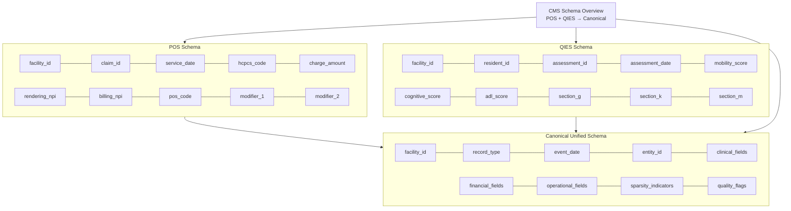

# Schema Overview

```mermaid
flowchart TD
    %% Title
    A0["CMS Schema Overview<br/>POS + QIES → Canonical"]

    %% POS Schema
    subgraph POS["POS Schema"]
        direction LR
        %% Row 1
        P1["facility_id"] --- P2["claim_id"] --- P3["service_date"] --- P4["hcpcs_code"] --- P5["charge_amount"]
        %% Row 2
        P6["rendering_npi"] --- P7["billing_npi"] --- P8["pos_code"] --- P9["modifier_1"] --- P10["modifier_2"]
    end

    %% QIES Schema
    subgraph QIES["QIES Schema"]
        direction LR
        %% Row 1
        Q1["facility_id"] --- Q2["resident_id"] --- Q3["assessment_id"] --- Q4["assessment_date"] --- Q5["mobility_score"]
        %% Row 2
        Q6["cognitive_score"] --- Q7["adl_score"] --- Q8["section_g"] --- Q9["section_k"] --- Q10["section_m"]
    end

    %% Canonical Unified Schema
    subgraph CAN["Canonical Unified Schema"]
        direction LR
        %% Row 1
        C1["facility_id"] --- C2["record_type"] --- C3["event_date"] --- C4["entity_id"] --- C5["clinical_fields"]
        %% Row 2
        C6["financial_fields"] --- C7["operational_fields"] --- C8["sparsity_indicators"] --- C9["quality_flags"]
    end

    %% Clean mapping arrows (subgraph → subgraph)
    POS --> CAN
    QIES --> CAN

    %% Notes
    A0 --> POS
    A0 --> QIES
    A0 --> CAN
```
