# Schema Overview

```mermaid
flowchart TD
    %% Title
    A0["🧩 CMS Schema Overview<br/>POS + QIES → Canonical"]

    %% POS Schema (blue)
    subgraph POS["📘 POS Schema"]
        direction LR
        P1["facility_id"]
        P2["claim_id"]
        P3["service_date"]
        P4["hcpcs_code"]
        P5["charge_amount"]
        P6["rendering_npi"]
        P7["billing_npi"]
        P8["pos_code"]
        P9["modifier_1"]
        P10["modifier_2"]

        P1 --- P2 --- P3 --- P4 --- P5
        P6 --- P7 --- P8 --- P9 --- P10
    end

    %% QIES Schema (blue)
    subgraph QIES["📙 QIES Schema"]
        direction LR
        Q1["facility_id"]
        Q2["resident_id"]
        Q3["assessment_id"]
        Q4["assessment_date"]
        Q5["mobility_score"]
        Q6["cognitive_score"]
        Q7["adl_score"]
        Q8["section_g"]
        Q9["section_k"]
        Q10["section_m"]

        Q1 --- Q2 --- Q3 --- Q4 --- Q5
        Q6 --- Q7 --- Q8 --- Q9 --- Q10
    end

    %% Canonical Unified Schema (green)
    subgraph CAN["📗 Canonical Unified Schema"]
        direction LR
        C1["facility_id"]
        C2["record_type"]
        C3["event_date"]
        C4["entity_id"]
        C5["clinical_fields"]
        C6["financial_fields"]
        C7["operational_fields"]
        C8["sparsity_indicators"]
        C9["quality_flags"]

        C1 --- C2 --- C3 --- C4 --- C5
        C6 --- C7 --- C8 --- C9
    end

    %% Mapping arrows
    POS --> CAN
    QIES --> CAN

    %% Notes
    A0 --> POS
    A0 --> QIES
    A0 --> CAN

    %% ============================
    %% COLOR CODING
    %% ============================

    %% POS (blue)
    style POS fill:#D0E7FF,stroke:#000,color:#000
    style P1 fill:#D0E7FF,stroke:#000,color:#000
    style P2 fill:#D0E7FF,stroke:#000,color:#000
    style P3 fill:#D0E7FF,stroke:#000,color:#000
    style P4 fill:#D0E7FF,stroke:#000,color:#000
    style P5 fill:#D0E7FF,stroke:#000,color:#000
    style P6 fill:#D0E7FF,stroke:#000,color:#000
    style P7 fill:#D0E7FF,stroke:#000,color:#000
    style P8 fill:#D0E7FF,stroke:#000,color:#000
    style P9 fill:#D0E7FF,stroke:#000,color:#000
    style P10 fill:#D0E7FF,stroke:#000,color:#000

    %% QIES (blue)
    style QIES fill:#D0E7FF,stroke:#000,color:#000
    style Q1 fill:#D0E7FF,stroke:#000,color:#000
    style Q2 fill:#D0E7FF,stroke:#000,color:#000
    style Q3 fill:#D0E7FF,stroke:#000,color:#000
    style Q4 fill:#D0E7FF,stroke:#000,color:#000
    style Q5 fill:#D0E7FF,stroke:#000,color:#000
    style Q6 fill:#D0E7FF,stroke:#000,color:#000
    style Q7 fill:#D0E7FF,stroke:#000,color:#000
    style Q8 fill:#D0E7FF,stroke:#000,color:#000
    style Q9 fill:#D0E7FF,stroke:#000,color:#000
    style Q10 fill:#D0E7FF,stroke:#000,color:#000

    %% Canonical (green)
    style CAN fill:#DFFFD6,stroke:#000,color:#000
    style C1 fill:#DFFFD6,stroke:#000,color:#000
    style C2 fill:#DFFFD6,stroke:#000,color:#000
    style C3 fill:#DFFFD6,stroke:#000,color:#000
    style C4 fill:#DFFFD6,stroke:#000,color:#000
    style C5 fill:#DFFFD6,stroke:#000,color:#000
    style C6 fill:#DFFFD6,stroke:#000,color:#000
    style C7 fill:#DFFFD6,stroke:#000,color:#000
    style C8 fill:#DFFFD6,stroke:#000,color:#000
    style C9 fill:#DFFFD6,stroke:#000,color:#000

    %% Title
    style A0 fill:#FFFFFF,stroke:#000,color:#000
```

---

## Responsibilities & Outputs — Schema Overview (POS + QIES → Canonical)

### 🧩 Overview

The schema layer defines how POS and QIES raw structures map into a unified canonical representation.  
This ensures deterministic ingestion, consistent downstream quality checks, and stable reporting artifacts.

---

### 📘 POS Schema — Responsibilities

- Define structural expectations for POS claims
- Validate facility, claim, service, and billing fields
- Normalize HCPCS, modifiers, POS codes
- Ensure financial fields meet minimal type guarantees

**Outputs**

- POS schema definition (internal)
- POS → Canonical mapping rules
- POS validation diagnostics

---

### 📙 QIES Schema — Responsibilities

- Define structural expectations for resident assessments
- Validate facility, resident, assessment identifiers
- Normalize mobility, cognitive, ADL, and section scores
- Ensure clinical fields meet minimal type guarantees

**Outputs**

- QIES schema definition (internal)
- QIES → Canonical mapping rules
- QIES validation diagnostics

---

### 📗 Canonical Unified Schema — Responsibilities

- Merge POS + QIES into a single event‑level structure
- Standardize identifiers (`facility_id`, `entity_id`, `record_type`)
- Normalize dates into `event_date`
- Partition fields into clinical, financial, operational groups
- Generate sparsity + quality indicators

**Outputs**

- Canonical schema specification
- Unified field dictionary
- Canonical mapping manifest
- Canonical validation diagnostics

---

### Legend

- **📘 POS Schema** — Claim‑level structure  
- **📙 QIES Schema** — Assessment‑level structure  
- **📗 Canonical Schema** — Unified event‑level structure  
- **🧩** — Schema overview title  
